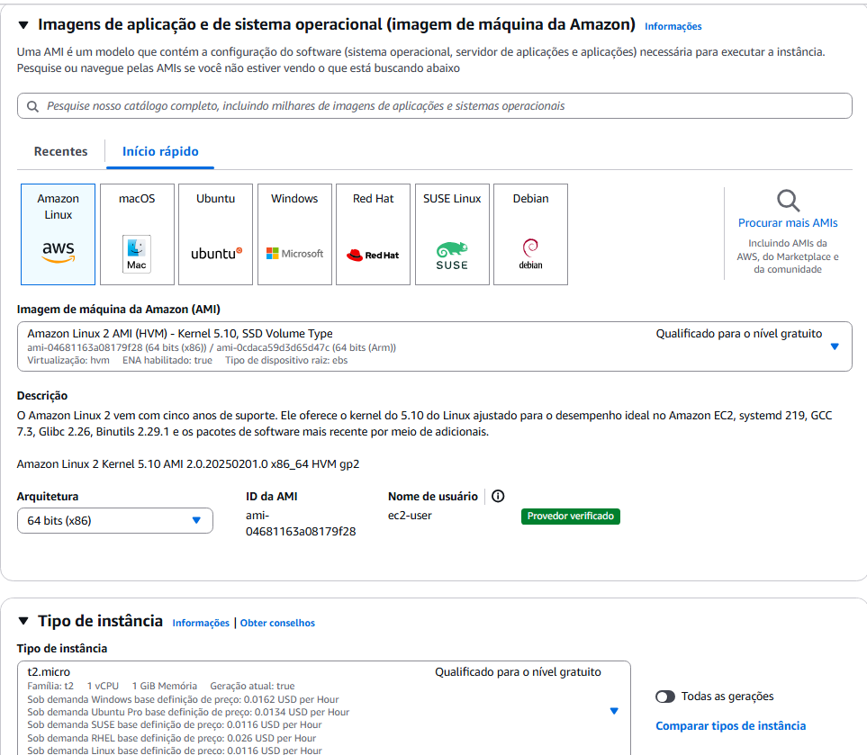

# AtividadeLinuxAWS
Atividade utilizando uma Instancia EC2 Linux, VPCs, WebServer Nginx e monitoramento de indisponibilidade

## Objetivos
Desenvolver e testar habilidades em Linux, AWS e automação de processos ao criar um servidor web com Nginx com monitoramento de indisponibilidade.

## Requisitos
- Computador com acesso a internet Windows
- Conta AWS
- Instância EC2 Ubuntu
- VPCs
- Nginx


## 0. Criação do Webhook no discord (prerequisito)

### Em um servidor do discord:

- Clique no icone de configurações do servidor
- Clique em Integrações > Webhooks
- Clique em Criar Webhook (ou modifique o Webhook existente)
- Insira o nome do Webhook
- Copie a URL do Webhook


## 1. Criação da VPC

A criação da VPC é o primeiro passo para criar uma instância EC2, a VPC personalizada garante maior controle sobre a comunicação entre os seus recursos e o acesso a internet. Para criar uma VPC:

Acesse o painel de VPC.


Acesse a tela de criação da VPC.

Nomeie a VPC e configure a criação de sub-redes.


Visualização da VPC:


Execute a criação da VPC.

### Criação do Security Group

Acesse a tela de criação de grupos de segurança (essa seção pode ser encontrada tanto no menu da EC2 quanto na aba de VPCs).

- Informe os detalhes básicos do Security Group (SG):
    - Importante: selecione a VPC criada para o projeto!


- Adicione as regras de entrada e saída:
    - As regras de entrada (SSH e HTTP) devem estar configuradas para o seu IP.
    - As regras de saída (HTTP e HTTPS) devem estar configuradas para qualquer endereço IPv4.
    


Em seguida, crie o grupo de segurança.

### Criação da Instancia EC2

Acesse o painel da instância:


Na tela de criação de instancias:

Configure o nome e as tags necessárias para a criação da sua instância.


Em seguida, escolha o tipo de instância e a AMI (imagem) que será utilizada: 

- Neste caso, a AMI Ubuntu será utilizada em uma instância do tipo t2.micro.



Escolha a chave SSH que será utilizada para acessar a instância:


Agora, altere as configurações de rede da instância:

- Selecione a VPC criada para o projeto.
- Na sub-rede, selecione uma das sub-redes públicas da sua VPC.
- Ative a atribuição de IP público.
- Selecione o SG criado para o projeto.


Na sessão de armazenamento:

- Selecione o tipo de armazenamento gp3 (é a versão melhorada e mais barata do armazenamento gp2).


Neste momento, a instância já pode ser criada.

## Etapa 2: Servidor Web

1. Instalar o servidor Nginx na EC2.
2. Criar uma página HTML para ser exibida.
3. Configurar o Nginx para servir a página.
    
    - Personalizar a página com informações sobre o projeto.
    
    - Criar um serviço `systemd` para reiniciar o Nginx automaticamente.
    

### Criação do servidor com `Nginx`

Após a instância ser criada, acesse a máquina via chave `SSH`.

Você também pode acessá-la usando o Visual Studio Code com a extensão `Remote - SSH`

Para fazer isso, instale a extensão, pressione `CTRL + SHIFT + P e acesse` → `Remote-SHH: Connect to host` , → `Configure SSH Hosts` → Edite o arquivo de configurações com suas informações.


Com a máquina conectada, o terminal ficará assim:


No terminal da instância, faça as atualizações necessárias:
```bash
sudo yum update -y
```

Agora, instale o `Nginx`:

```bash
sudo amazon-linux-extras enable nginx1
sudo yum install nginx -y
```

Inicialize e habilite o `Nginx`:

```bash
sudo systemctl start nginx
sudo systemctl enable nginx
```

Verifique o status:

```bash
sudo systemctl status nginx
```

O terminal deve exibir:


### Criação da pagina `HTML`

Crie a página HTML a ser exibida:

```bash
sudo nano /usr/share/nginx/html/index.html
```
(Verifique se o seu Nginx está apontando para o diretório correto. Por padrão, ele pode estar configurado para `/var/www/html` em vez de `/usr/share/nginx/html`)


O terminal abrirá o `nano` para edição do arquivo `index.html`:

Aqui, você deve digitar ou colar o código HTML que será exibido.


[Pagina HTML](index.html)
[Folha de estilo](style.css)


Salve o arquivo com `CTRL + X`, `Y`, `Enter`

Reinicie o `Nginx` para começar a exibir a página HTML:

```bash
sudo systemctl restart nginx
```

Agora, acesse a instância pelo IP público no navegador:

`http://SEU_IP_PUBLICO`


## Etapa 3: Monitoramento e notificações

### Instalação de bibliotecas
Para iniciar a criação do script, verifique se a versão do Python e do `pip` (gerenciador de pacotes do Python) está atualizada. Caso contrário, atualize-as.

```bash
python3 --version
pip3 --version
```

Agora, será possível instalar as bibliotecas necessárias para a execução do script:

```bash
pip install requests
pip install logging
```

Caso não seja possível instalar usando o `pip`, você pode utilizar o `apt`:

```bash
sudo apt install python3-requests
sudo apt install python3-logging
```

### Criação do script
Agora, crie o script em um diretório de sua preferência:

```bash
sudo nano /home/ubuntu/scripts/server_status.py
```

Em seguida, cole o script e salve as alterações com `CTRL + X, Y, ENTER`

[Script de monitoramento](script.py)

Adicione permissão de execução ao script:

```bash
sudo chmod +x server_status.py
```

Teste o script:

```bash
python3 server_status.py
```

### Automação

Agora, crie a automação utilizando o serviço `crontab`:

```bash
crontab -e
1
```
Quando o arquivo de configuração abrir com o `nano`, adicione a linha:
```bash
* * * * * /usr/bin/python3 /home/ubuntu/scripts/server_status.py
```
Isso garantirá que o script seja executado automaticamente a cada minuto.

Em seguida, ative a execução do serviço `contrab` :

```bash
sudo systemctl enable cron
```

## Etapa 4: teste da implementação


Verifique se a página web está funcionando corretamente acessando:

`http://SEU_IP_PUBLICO`

No terminal da instância, verifique se o script está sendo executado a cada minuto:
```bash
crontab -e
```

Acesse o arquivo de log do script para verificar se as informações estão sendo registradas corretamente:
```bash
cat /var/log/server_status.log
```
Encerre o serviço do `nginx` e verifique se status foi notificado no discord:
```bash
sudo systemctl stop nginx
```


